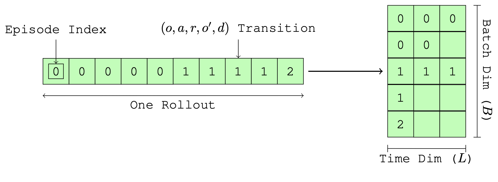
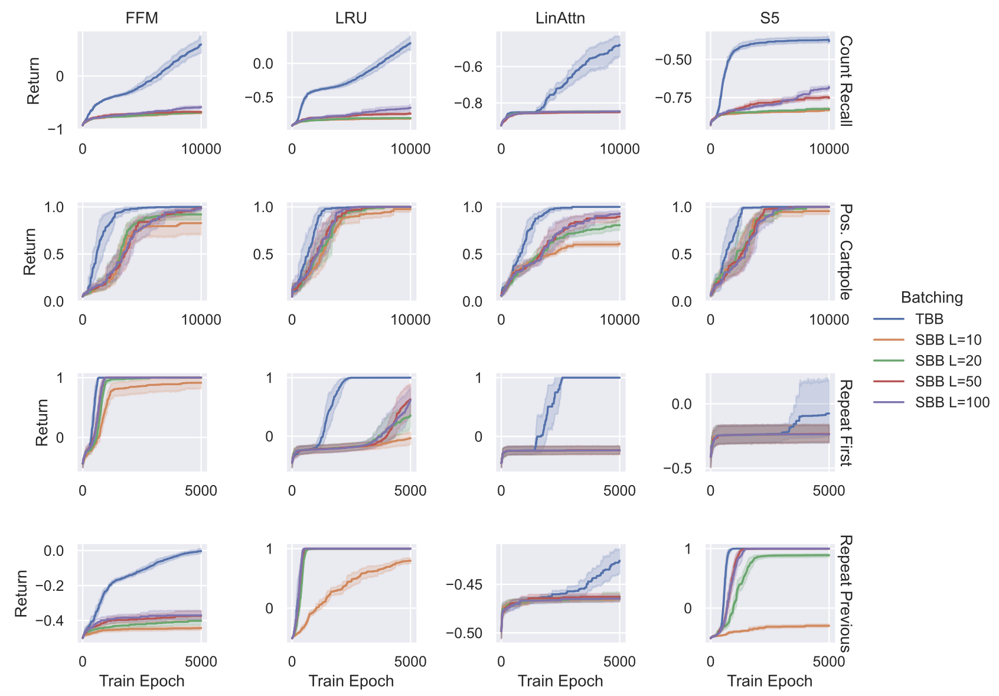

# Revisiting Recurrent Reinforcement Learning with Memory Monoids

This repository contains the code for *Revisiting Recurrent Reinforcement Learning with Memory Monoids*.

The standard way to train recurrent policies in RL could use some improvement. We usually truncate and zero-pad trajectories to a fixed length so that we can create a tensor of shape `[Batch x Seq. Length]`, as depicted below:

We call this approach **Segment-Based Batching (SBB)**. However, this breaks up episodes such that we cannot backpropagate through the entire episode, hindering policy learning. Furthermore, the zero-padding ends up costing extra space and compute, as well as breaking Batch Normalization and similar methods. Finally, SBB requires implementing padding-aware loss functions. I find that in practice, this introduces bugs, as these padding-aware recurrent loss functions can be very complex.

We propose a simple alternative that we call **Tape-Based Batching (TBB)**: collapse the batch dimension into the sequence length dimension and treat our data as **one very long list**. This would be inefficient for a transformer or LSTM, but not for sequence models that scale logarithmically with the length of the sequence, like State-Space Models, Fast and Forgetful Memory, or Linear Transformers.

With one long list, we resolve most issues caused by segment-based batching. We no longer need to truncate and pad, we no longer truncate backpropagation, and we can use non-recurrent loss functions (PPO, Q learning, etc) to train recurrent policies. Please see the paper (link forthcoming) for how we accomplish this, or look at `buffer.py` and `tape_dqn.py` to see how we implement this.

We find that replacing SBB with TBB greatly improves sample efficiency across a number of models and environments (our approach is in blue, compared against segment-based batching with various segment lengths).

## Repository Structure

- `collector/` contains the sample collection code
- `experiments/` contains experiments as yaml files
- `memory/` contains memory model implementations
- `plotting/` contains plotting tools and scripts used to generate all plots
- `buffer.py` contains replay buffers for SBB and TBB
- `losses.py` contains loss and update functions
- `segment_dqn.py` runs a SBB double DQN, given a SBB experiment. For example, `python segment_dqn.py experiments/cartpole_easy/segment_s5_10_100.yaml` 
- `tape_dqn.py` runs a TBB double DQN, given a tape experiment. For example, `python tape_dqn.py experiments/cartpole_easy/tape_s5.yaml`
- `utils.py` contains various utilities
- `modules.py` contains definitions of the models as well as various utilities
- `returns.py` implements the discounted return as a memory monoid, records the time taken, and ensures the memory monoid is correct
- `run_experiments.sh` is a way to run many experiments at once
- `requirements.txt` should contain necessary packages to run the scripts (without versions, to avoid dependency hell)
- `requirements_freeze.txt` contains the exact dependency verions for the experiments (if `requirements.txt` does not work)